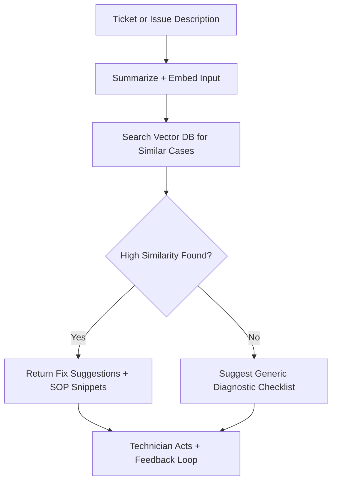

# ⚙️ Diengg – AI Copilot for Field Service Engineers

> 🧠 "Your on-site diagnostic intelligence—engineered for engineers."

## 🔍 The Problem

Field service engineers face a critical challenge in the form of knowledge fragmentation and accessibility when diagnosing equipment issues on-site:

### Key Challenges:

- **Knowledge Silos**: Valuable diagnostic information is scattered across multiple systems - ticket databases, equipment manuals, maintenance logs, and SOPs - making it difficult to access the right information at the right time.

- **Time Pressure**: Engineers often work under strict time constraints with equipment downtime directly impacting client operations and revenue. The pressure to resolve issues quickly can lead to missed diagnostic steps or incomplete solutions.

- **Information Overload**: A single piece of industrial equipment may have thousands of pages of documentation, making it impractical to manually search for relevant information while on-site.

- **Experience Gap**: Experienced engineers carry invaluable tacit knowledge that is lost when they retire or leave. New technicians lack access to this accumulated wisdom, creating inconsistent service quality.

- **Connectivity Limitations**: Many service locations have poor internet connectivity, limiting real-time access to online knowledge bases or the ability to consult remote experts.

- **Repeated Issues**: Without a system to learn from past resolutions, engineers often "reinvent the wheel" when facing issues that have been previously solved by colleagues.

These challenges result in longer mean-time-to-repair (MTTR), higher service costs, excessive escalations to L2/L3 support, and ultimately, reduced customer satisfaction.

## 🎯 Our Approach

Diengg solves these problems through an AI-powered diagnostic assistant that:

1. **Retrieval-Augmented Generation (RAG)** - Combines knowledge retrieval with generative AI to find the most relevant solutions from past cases
2. **Unified Knowledge Access** - Centralizes access to ticket logs, manuals, SOPs, and field reports in a searchable format
3. **Intelligent Similarity Matching** - Uses vector embeddings to find semantically similar past issues, even when described differently
4. **Guided Diagnostic Workflow** - As shown in our system flowchart:

flowchart TD
    A(Start) --> B(Ticket is Raised)

    B --> C1(Pull Past Ticket History)
    C1 --> C1a(Find similar tickets)
    C1 --> C1b(Extract useful info)

    B --> C2(Pull Sensor Data (at/around issue time))
    C2 --> C2a(Analyze for Anomalies)
    C2a --> C2b(Check Anomaly Relevance to Issue)
    C2b --> C2c(Generate Possible Cause Report)

    B --> C3(Pull Related Documentation)
    C3 --> C3a(Manuals)
    C3 --> C3b(SOPs)
    C3 --> C3c(Known issue reports)

    C1b --> D(Consolidate All Data)
    C2c --> D
    C3c --> D

    D --> E(Generate Final Report)


*The flowchart illustrates how Diengg processes ticket information by pulling from past ticket history, sensor data, and related documentation to generate comprehensive diagnostic reports.*

The system works by:
1. Processing ticket information when an issue is raised
2. Simultaneously pulling from three knowledge sources:
   - Past ticket history (finding similar tickets and extracting useful information)
   - Sensor data (analyzing anomalies relevant to the issue)
   - Related documentation (manuals, SOPs, known issue reports)
3. Consolidating all data sources
4. Generating a comprehensive diagnostic report with actionable solutions

## ⚙️ Setup Instructions

### Prerequisites
- Python 3.8+
- Docker and Docker Compose
- OpenAI API key
- Milvus or similar vector database

### Installation

```bash
git clone https://github.com/yourorg/diengg.git
cd diengg

# Set up backend
cd backend
pip install -r requirements.txt

# Configure environment variables
cp .env.example .env
# Edit .env with your API keys and configuration

# Start the vector database
docker-compose up -d milvus

# Run the application
python -m app.main

# Start the frontend (Streamlit)
cd ../ui
streamlit run app.py
```

## 🚀 What It Does

- ✅ Understands the issue from a technician's notes or ticket input  
- 🔍 Searches past ticket logs, fixes, and SOPs using **Retrieval-Augmented Generation (RAG)**  
- 🧩 Returns the most relevant past fixes and diagnostic steps  
- 🛠️ Equips engineers with faster decision-making and reduced trial-and-error

## 🧱 Technical Architecture



## 🔧 Tech Stack

| Layer           | Tech/Tool                        |
|-----------------|----------------------------------|
| Embeddings      | OpenAI (Ada)                     |
| Vector DB       | Milvus                           |
| Backend         | Python (FastAPI)                 |
| RAG Framework   | LangChain                        |
| Interface       | Streamlit                        |
| Deployment      | Docker                           |

## 📝 Sample Workflow

1. **Engineer logs issue**:  
   *"Unit 12 showing overcurrent alarm. Error code E43 blinking."*

2. **AI Engine**:
   - Summarizes and embeds the description  
   - Searches the knowledge base for top 3 similar cases  
   - Retrieves past fixes: "Replace CT cable – Error E43 triggered by surge."

3. **Output**:
   - Returns fix steps, parts used, and resolution time  
   - Offers direct link to ticket logs or SOPs

## 🧠 Knowledge Base Sources

Diengg can be connected to:

- ✅ Past ticket logs (CSV, JSON, DB)
- ✅ PDF manuals, SOPs, wiring diagrams
- ✅ Field reports / maintenance logs
- ✅ Notion, Confluence, Google Drive (optional integrations)

All content is **chunked and embedded** into a vector DB for fast semantic search.

## ⚡ API Endpoints

| Method | Endpoint           | Description                        |
|--------|--------------------|------------------------------------|
| `POST` | `/diagnose`        | Submit a new issue description     |
| `POST` | `/kb/upload`       | Upload new document(s) to KB       |
| `GET`  | `/kb/search?q=...` | Search KB manually                 |
| `POST` | `/feedback`        | Submit feedback on AI suggestions  |

## 📊 Metrics You Can Track

- Avg. similarity score returned  
- % of queries resolved without escalation  
- Top repeated fixes  
- Technician feedback score on AI suggestions

## 📁 Project Structure

```bash
diengg/
├── backend/
│   ├── app/
│   │   ├── __init__.py
│   │   ├── main.py              # FastAPI application entry point
│   │   ├── config.py            # Configuration management
│   │   ├── database/
│   │   │   ├── __init__.py
│   │   │   ├── milvus.py        # Milvus connection and operations
│   │   │   └── models.py        # Data models
│   │   ├── api/
│   │   │   ├── __init__.py
│   │   │   ├── v1/
│   │   │   │   ├── __init__.py
│   │   │   │   ├── diagnose.py  # Diagnosis endpoint
│   │   │   │   ├── kb.py        # Knowledge base endpoints
│   │   │   │   └── feedback.py  # Feedback endpoint
│   │   ├── core/
│   │   │   ├── __init__.py
│   │   │   ├── embeddings.py    # Embedding generation
│   │   │   └── rag.py           # RAG implementation
│   │   └── utils/
│   │       ├── __init__.py
│   │       ├── logging.py       # Logging configuration
│   │       └── helpers.py       # Helper functions
│   ├── tests/
│   │   ├── __init__.py
│   │   ├── test_api.py
│   │   └── test_core.py
│   ├── requirements.txt
│   └── .env.example
├── embeddings/           # Embedding + chunking logic
│   └── embed_kb.py
│
├── vector_db/            # Setup for Milvus
│
├── ui/                   # Frontend (Streamlit)
│
├── kb_samples/           # Sample PDFs, ticket logs
│
└── README.md
```

## 🔍 Example Input / Output

**Input:**
```json
{
  "ticket_text": "System 14 keeps restarting randomly, fan noise is loud, and smell of burning plastic reported."
}
```

**Output:**
```json
{
  "summary": "Fan overheating + suspected hardware failure",
  "suggested_fix": "Similar case resolved by replacing PSU module and cleaning vents",
  "confidence": 0.91,
  "source_case": "#TCK-1243 - Oct 2023"
}
```

## 📢 Future Extensions

- ✅ OCR for handwritten technician notes  
- ✅ Mobile-first UI for on-site access  
- ✅ Multilingual KB support  
- ✅ Feedback training loop to improve recommendations  
- ✅ Image recognition of machine parts for diagnostics

## 🤝 Contributing

Pull requests welcome! Please raise an issue first to discuss what you'd like to add.

## 📄 License

MIT License – do whatever you want, just don't forget to credit the builders 💡

## 🧑‍💻 Built At

> 🛠️ Built at **The Better Hack Bengaluru**  
> ✨ By [Your Team Name] – [your handles or credits]