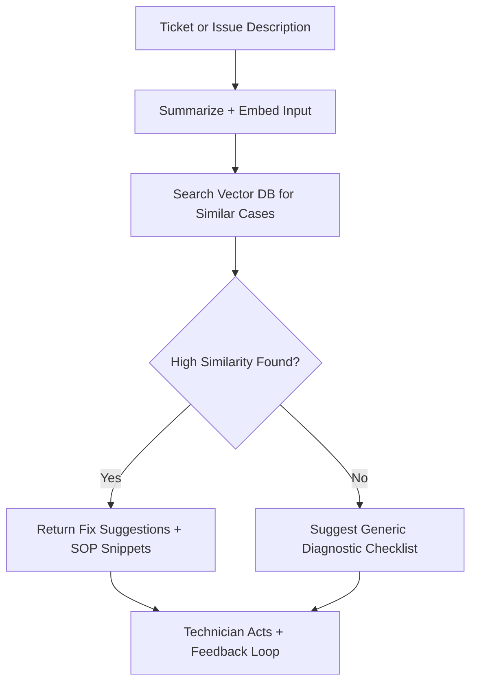

# ⚙️ Diengg – AI Copilot for Field Service Engineers

**Diengg** is an AI-powered diagnostic assistant designed for field service engineers. It helps technicians diagnose issues faster on-site by retrieving relevant historical fixes, past ticket resolutions, and internal knowledge from manuals, SOPs, and documentation.

> 🧠 “Your on-site diagnostic intelligence—engineered for engineers.”

---

## 🚀 What It Does

- ✅ Understands the issue from a technician’s notes or ticket input  
- 🔍 Searches past ticket logs, fixes, and SOPs using **Retrieval-Augmented Generation (RAG)**  
- 🧩 Returns the most relevant past fixes and diagnostic steps  
- 🛠️ Equips engineers with faster decision-making and reduced trial-and-error

---

## 🧱 Architecture



---

## 🔧 Tech Stack

| Layer           | Tech/Tool                        |
|----------------|----------------------------------|
| Embeddings      | OpenAI (Ada), Cohere, or HuggingFace |
| Vector DB       | Pinecone, Weaviate, or FAISS     |
| Backend         | Python (FastAPI / Flask)         |
| RAG Framework   | LangChain / Haystack             |
| Interface       | Streamlit, React, or CLI         |
| Deployment      | Docker + Render / Railway / GCP  |

---

## 📝 Sample Workflow

1. **Engineer logs issue**:  
   *“Unit 12 showing overcurrent alarm. Error code E43 blinking.”*

2. **AI Engine**:
   - Summarizes and embeds the description  
   - Searches the knowledge base for top 3 similar cases  
   - Retrieves past fixes: “Replace CT cable – Error E43 triggered by surge.”

3. **Output**:
   - Returns fix steps, parts used, and resolution time  
   - Offers direct link to ticket logs or SOPs

---

## 🧠 Knowledge Base Sources

Diengg can be connected to:

- ✅ Past ticket logs (CSV, JSON, DB)
- ✅ PDF manuals, SOPs, wiring diagrams
- ✅ Field reports / maintenance logs
- ✅ Notion, Confluence, Google Drive (optional integrations)

All content is **chunked and embedded** into a vector DB for fast semantic search.

---

## ⚡ API Endpoints (Sample)

| Method | Endpoint           | Description                        |
|--------|--------------------|------------------------------------|
| `POST` | `/diagnose`        | Submit a new issue description     |
| `POST` | `/kb/upload`       | Upload new document(s) to KB       |
| `GET`  | `/kb/search?q=...` | Search KB manually                 |
| `POST` | `/feedback`        | Submit feedback on AI suggestions  |

---

## 📊 Metrics You Can Track

- Avg. similarity score returned  
- % of queries resolved without escalation  
- Top repeated fixes  
- Technician feedback score on AI suggestions

---

## 📁 Project Structure

```bash
diengg/
│
├── backend/              # FastAPI or Flask backend
│   ├── main.py
│   ├── rag_engine.py
│   └── routes/
│
├── embeddings/           # Embedding + chunking logic
│   └── embed_kb.py
│
├── vector_db/            # Setup for Pinecone / FAISS
│
├── ui/                   # Frontend (Streamlit / React)
│
├── kb_samples/           # Sample PDFs, ticket logs
│
└── README.md
```

---

## 🛠️ Setup Instructions

```bash
git clone https://github.com/yourorg/diengg.git
cd diengg

# Set up backend
cd backend
pip install -r requirements.txt
python main.py

# Run frontend (if Streamlit)
cd ../ui
streamlit run app.py
```

🔑 Add your OpenAI / Pinecone / other API keys in `.env`

---

## 🔍 Example Input / Output

**Input:**
```json
{
  "ticket_text": "System 14 keeps restarting randomly, fan noise is loud, and smell of burning plastic reported."
}
```

**Output:**
```json
{
  "summary": "Fan overheating + suspected hardware failure",
  "suggested_fix": "Similar case resolved by replacing PSU module and cleaning vents",
  "confidence": 0.91,
  "source_case": "#TCK-1243 - Oct 2023"
}
```

---

## 🧪 Demo Scenarios

- Upload `ticket_logs.csv` and `manual.pdf` as KB  
- Run `/diagnose` with new field issue descriptions  
- Show real-time suggestions, confidence, and linked resolutions

---

## 📢 Future Extensions

- ✅ OCR for handwritten technician notes  
- ✅ Mobile-first UI for on-site access  
- ✅ Multilingual KB support  
- ✅ Feedback training loop to improve recommendations  
- ✅ Image recognition of machine parts for diagnostics

---

## 🧠 Why Diengg?

Field service teams are overwhelmed with repeated issues, unclear SOPs, and poor access to past data. **Diengg gives every engineer a second brain**—on the field, offline or online, with just their ticket text.

---

## 🤝 Contributing

Pull requests welcome! Please raise an issue first to discuss what you’d like to add.

---

## 📄 License

MIT License – do whatever you want, just don’t forget to credit the builders 💡

---

## 🧑‍💻 Built At

> 🛠️ Built at **The Better Hack Bengaluru**  
> ✨ By [Your Team Name] – [your handles or credits]
